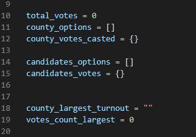

# Written Analysis of the Election Audit

## Overview of Election Audit

   This is an analysis of an election audit of the tabulated results for US. We need to report the total number of votes cast, the total 
   number of votes for each candidate, the percentage of votes for each candidate, and the winner of the election based on the popular vote. 
   There are three primary voting methods that were taken into account: Mail-in ballots, punch cards, and direct recording electronic or DRE 
   counting. The votes casted by these three methods althogether will determine the final election results.

## Resources
  - Data Source: election_results.csv
  - Software: Python 3.7.6, Visual Studio Code 1.56.2
   
## Election-Audit Results

  - Total votes casted are 369,711
  - Number of votes and percentage of the total votes for each county is:
    - Jefferson: 38,855 (10.5%)
    - Denver: 306,055 (82.8%)
    - Arapahoe: 24,801 (6.7%)
  - County with the largest number of votes is **Denver** with **306,055** votes
  - Total number of votes and percentage of each candidate is:
    - Diana DeGette: 73.8% (272,892)
    - Charles Casper Stockham: 23.0% (85,213)
    - Raymon Anthony Doane: 3.1% (11,606)
  - Winner candidate name, the vote count, and percentage of the total votes is:
    - Winner: Diana DeGette
    - Winning Vote Count: 272,892
    - Winning Percentage: 73.8%
 
 ## Election-Audit Summary

  This script of the election result can be used-with some modifications-for any elections.
  For example:
  - **By modyfying the dataset file path**: change the file path of the csv file with the elections results. 
  
  - **Names of the variable**: the names of the variables in the script can be changed according to the election results we analyze, e.g., 
    if we use the script for the State Elections, "County" can be replaced by "State". See the image below:

  
  - **Column reference in the csv file**: the column refernces can be modified as per the data in file e.g., in our file, "county name" was
    stored in "row[1]" and "candidate name" was stored in "row[2]"
```
for row in file_reader:
  name_of_county = row[1]
  name_of_candidate = row[2]

``` 
